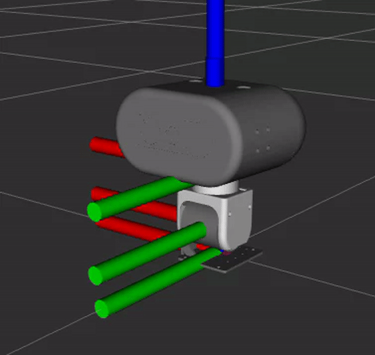

# openarmx_head_bringup

English | [中文](./README-CN.md)

---




Launch files and controller configuration for the OpenArmX 2-DOF head (yaw + pitch).

## Overview

This package brings up the full ros2_control stack for the OpenArmX head, including:

- Robot state publisher (from URDF/xacro)
- ros2_control controller manager (100 Hz update rate)
- `joint_state_broadcaster` for publishing joint states
- `head_forward_position_controller` (ForwardCommandController) for position commands
- Optional RViz2 visualization

The launch file handles controller startup ordering automatically to avoid race conditions.

## Dependencies

- `openarmx_head_description` (URDF)
- `openarmx_head_hardware` (hardware interface plugin)
- `controller_manager`, `joint_state_broadcaster`, `forward_command_controller`
- `robot_state_publisher`, `xacro`, `rviz2`

## Build

```bash
cd ~/openflex_ws
colcon build --packages-select openarmx_head_bringup
source install/setup.bash
```

## Launch

```bash
ros2 launch openarmx_head_bringup head.launch.py
```

### Launch Arguments

| Argument | Default | Description |
|----------|---------|-------------|
| `can_interface` | `can2` | CAN bus interface for head motors |
| `use_fake_hardware` | `false` | Use simulated hardware (no real motors) |
| `can_fd` | `false` | Enable CAN-FD mode |
| `control_mode` | `csp` | Low-level motor control mode: `mit` or `csp` |
| `launch_rviz` | `true` | Launch RViz2 with head model |

### Examples

```bash
# Real hardware on can2, CSP mode

---
ros2 launch openarmx_head_bringup head.launch.py

# Simulated hardware for testing

---
ros2 launch openarmx_head_bringup head.launch.py use_fake_hardware:=true

# MIT control mode on can0

---
ros2 launch openarmx_head_bringup head.launch.py can_interface:=can0 control_mode:=mit
```

## Controllers

Configured in `config/head_controllers.yaml`:

- **joint_state_broadcaster**: Publishes joint states to `/joint_states`
- **head_forward_position_controller**: Accepts position commands for joints `openarmx_head_yaw_joint` and `openarmx_head_pitch_joint`

### Command Topic

```
/head_forward_position_controller/commands  [std_msgs/Float64MultiArray]
```

Data array order: `[yaw, pitch]` (radians)

## Topics

| Topic | Type | Direction | Description |
|-------|------|-----------|-------------|
| `/joint_states` | `sensor_msgs/JointState` | Published | Current joint positions, velocities, efforts |
| `/head_forward_position_controller/commands` | `std_msgs/Float64MultiArray` | Subscribed | Position commands [yaw, pitch] in radians |
| `/robot_description` | `std_msgs/String` | Published | URDF robot description |

## TF Frames

- `world` -> `head_base_link` (fixed)
- `head_base_link` -> `head_pitch_link` (revolute, pitch joint)
- `head_pitch_link` -> `head_yaw_link` (revolute, yaw joint)

## Notes

- The CAN interface (e.g. `can2`) must be up before launching. Use `sudo ip link set can2 up type can bitrate 1000000`.
- Controller startup is sequenced: joint_state_broadcaster starts after controller_manager is ready, then head_forward_position_controller starts after joint_state_broadcaster is loaded.

## License

This work is licensed under the Creative Commons Attribution-NonCommercial-ShareAlike 4.0 International License (CC BY-NC-SA 4.0).

Copyright (c) 2026 Chengdu Changshu Robot Co., Ltd. (成都长数机器人有限公司)

For more details, see the [LICENSE](LICENSE) file or visit: http://creativecommons.org/licenses/by-nc-sa/4.0/

## Acknowledgments

This package is part of the OpenArmX robotic platform ecosystem, developed for research and industrial applications in collaborative robotics.

---

## 📞 Contact Us

### Chengdu Changshu Robot Co., Ltd.

| Contact           | Information                                                                                                  |
| ----------------- | ------------------------------------------------------------------------------------------------------------ |
| 📧 Email          | [openarmrobot@gmail.com](mailto:openarmrobot@gmail.com)                                                      |
| 📱 Phone / WeChat | +86-17746530375                                                                                              |
| 🌐 Website        | [https://openarmx.com/](https://openarmx.com/)                                                               |
| 🌐 Documentation  | [http://docs.openarmx.com/](http://docs.openarmx.com/)                                                               |
| 📍 Address        | Huacheng Machinery Plant, No.11 Xinye 8th Street, West Area, Tianjin Economic-Technological Development Area |
| 👤 Contact Person | Mr. Wang                                                                                                     |
